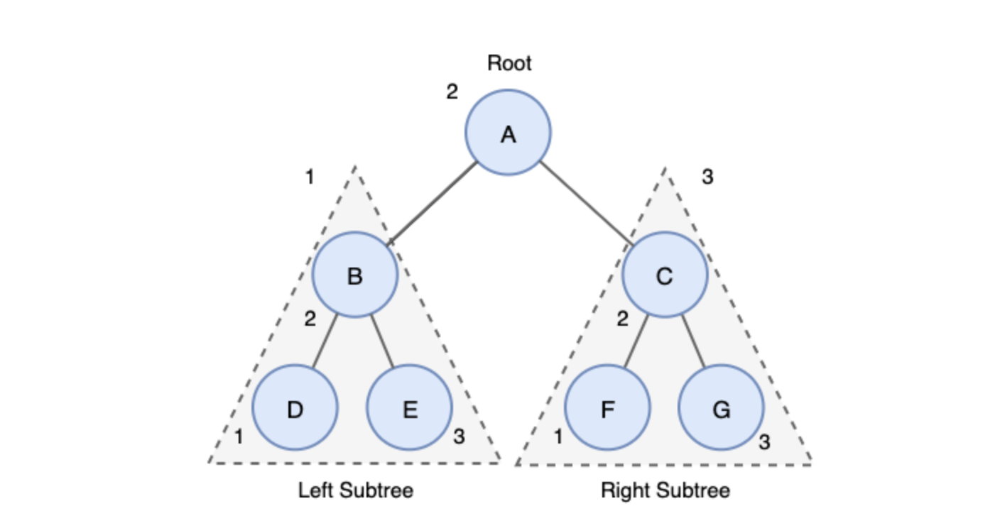

## 풀이

부모가 가지고 있는 자식 노드의 최대 뎁스는 왼쪽 노드 뎁스와 오른쪽 노드 뎁스 중 더 큰 것) 이므로,
최종 뎁스는 1(본인) + Math.max(왼쪽 노드 뎁스, 오른쪽 노드 뎁스) 가 된다. 이를 재귀로 대상 루트 기준 root.left, root.right를 가지고 계산한다.

## Tree

### 정의

- 데이터 항목들을 `부모 노드 - 자식 노드`의 계층으로 표현
- 저장된 데이터를 더 효과적으로 탐색하기 위하여 사용하며, **루트를 제외한 모든 노드는 단 하나의 부모를 가짐**

### 트리의 종류

- 이진트리 (Binary Tree): 트리의 각 노드가 최대 2개의 자식 노드를 가지는 트리
  
- 전이진트리 (Full Binary Tree): 모든 노드가 0개 또는 2개의 자식을 가짐
- 완전이진트리 (Complete Binary Tree): 마지막 레벨을 제외한 모든 레벨이 완전히 채워진 트리,
  마지막 레벨은 완전히 채워지지 않아도 되지만 무조건 왼쪽 노드 → 오른쪽 노드 방향으로 채워져야 함
- 포화이진트리 (Perfect Binary Tree): 모든 노드가 2개의 자식 노드를 가지며, 모든 노드가 동일한 레벨
- 균형이진트리 (Balanced Binary Tree): 왼쪽과 오른쪽 트리 높이 차이가 모두 1만큼 나는 트리
  (ex) AVL

### 이진 탐색 트리

이진 탐색 트리는 데이터를 찾는 속도가 빠르기 때문에(`O(log n)`) 탐색에서 자주 사용

루트 기준 왼쪽 노드의 값은 루트보다 작고, 오른쪽 노드의 값은 루트보다 큼 (중위 순회시 오름차순)

- 탐색 연산
  주어진 값이 루트와 같으면 탐색 성공 → 값이 루트보다 작으면 왼쪽 재귀 → 크면 오른쪽 재귀
- 삽입 연산
  탐색 → 탐색에 실패 시(주어진 값을 찾았는데 없을 때) 해당 위치에 삭제
- 삭제 연산

  1. 삭제 노드가 단말 노드인 경우

     단말 노드의 부모 노드를 탐색하여 연결 해제

  2. 삭제 노드가 하나의 서브를 가지고 있는 경우

     해당 노드 삭제 후 본인이 가지고 있던 서브 트리를 부모 트리에 붙임

  3. 삭제 노드가 두개의 서브를 가지고 있는 경우

     삭제할 노드와 가장 근사한 값을 가진 노드(직후 노드 또는 직전 노드)를 삭제할 노드 위치로 삽입

### 트리 순회

트리의 모든 노드들을 한 번 씩 방문하는 과정을 트리 순회(Tree Traversal)라고 함, 재귀로 구현

- 전위 순회 (pre-order)
  
  - **root** → root.left → root.right
  - 트리 복사시 사용
- 중위 순회 (in-order)
  
  - root.left → **root** → root.right
  - 오름차순 및 내림차순으로 값 가져올 때 사용
- 후위 순회 (post-order)
  
  - root.left → root.right → **root**
  - 트리 삭제시 사용 (자식 노드를 먼저 삭제하고 부모 노드를 삭제해야 하므로)
