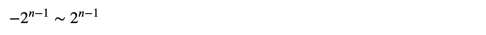

## 조건

- 곱은 32bit 정수임을 보장

  따라서 32bit는 −2,147,483,648 ~ 2,147,483,647까지 나타낼 수 있음

  

- 시간 복잡도는 `O(n)`(n의 개수 번 만큼 실행)이어야 하며, 나누기 연산 사용 금지

## 고민

- 배열의 총 곱셈값을 구한 후, num 배열을 for문으로 돌면서 본인을 나눈 값을 사용하는 방식 -> 나누기 연산 금지 조건을 충족하지 못함
- num의 개수만큼만 for문으로 순회하면서, 어떻게 본인 제외 나머지의 곱을 구할지 그 방법을 생각하는 것이 관건
- 힌트에는 num의 suffix와 prefix의 곱을 이용하고, 배열을 수정하여 계산한 중간 값을 저장하고 중복 계산을 피하는 방식에 대해 생각해보라고 되어있었음 -> 동적계획법인가?

## O(n)에서 중첩되지 않은 for문을 여러개 사용해도 되는가?

서로 다른 개별 컬렉션에 대해 각각 loop를 사용하는 것은, 서로 독립적인 것으로 간주하여 시간복잡도에 곱셈이 되는 것이 아니고 덧셈이 되므로 상관 없음 -> 이걸 몰라서 한참 해메었다.

## 풀이

1. nums 배열을 왼쪽에서 부터 순회하면서 result 배열에 저장

   `result = {1, 1*a, 1*a*b, 1*a*b*c}`

2. nums 배열을 오른쪽에서 부터 역순으로 순회하면서 nums 배열에 저장

   `nums = {a*b*c*d, b*c*d, c*d, d}`

3. result[i] = result[i] + nums[i+1]을 리턴

   `result = {b*c*d, a*c*d, a*b*d, a*b*c}`
