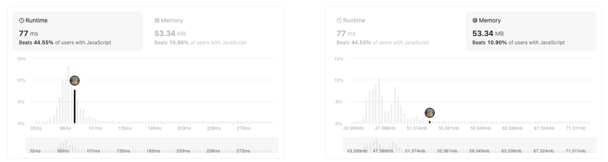

## 풀이

앞자리: 2차원 배열의 첫번째 인덱스, 뒷자리: 두번째 인덱스

1. 앞자리 0부터 시작해서 1씩 증가, 뒷자리는 시작(0)으로 픽스
2. 앞자리 증가해서 row 수와 같아지면(row-1인덱스) 앞자리 1씩 감소, 뒷자리 1씩 증가 > 언제까지? > 앞자리 감소하다가 0이 될 때 까지
3. 앞자리가 0찍으면 그 ‘이후’부터 다시 앞자리 1씩 증가, 뒷자리 고정
4. 생성한 2차원 배열을 열-행 순서대로 순회하며 문자열 완성한 후 출력

## 설명

front, back, unit 등의 변수를 따로 선언해서 그렇거나, arr을 2차원 배열로 선언한 것 자체가 메모리를 꽤 차지하는 것 같다.



## 다른 풀이

내가 푼 방식과 원리는 비슷한데, 나는 2차원 배열을 만들어서 2개의 인덱스를 관리했다면, 이 풀이에서는 1차원 배열에 문자열을 관리하는 방식으로 풀이함. 즉, 2차원 배열에서 문자열 각각 관리하는 대신, 1차원 배열의 각 요소가 2차원 배열을 합친 문자열. 따라서 메모리를 더 아낄 수 있음

(ex) [ 'PAHN', 'APLSIIG', 'YIR' ]

런타임 시간은 비슷한, 메모리 사용량이 44.56MB까지 축소됨

```js
const convert = function (s, numRows) {
  if (numRows === 1) return s;

  let row = 0;
  let step;
  let solve = new Array(numRows).fill("");

  for (let i = 0; i < s.length; i++) {
    solve[row] += s[i];
    if (row == 0) step = 1;
    if (row == numRows - 1) step = -1;
    row += step;
  }

  return solve.join("");
};
```
