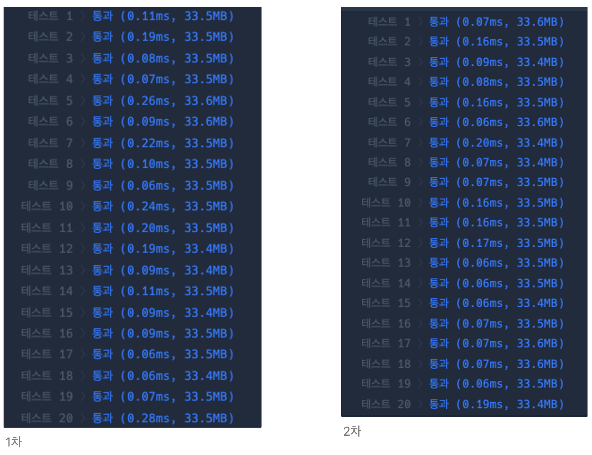

## 풀이

- 현재 단어의 첫번째 글자가 이전 단어의 마지막 글자와 다르면 return
- 현재 단어 기준, 현재 단어 앞의 지난 단어들 중 현재 단어가 포함되어 있으면 이미 얘기한 단어이므로 return
- for문을 순회할 동안 return한 값이 없으면 탈락자가 없는 것이므로 [0, 0] return
- 탈락 대상자 순번: `i % n + 1`, 탈락한 차례: `i / n + 1`

## 1차 코드

```js
function solution(n, words) {
  for (let i = 0; i < words.length; i++) {
    const beforeWord = words[i - 1];

    if (beforeWord) {
      if (words[i][0] !== beforeWord[beforeWord.length - 1]) {
        return [(i % n) + 1, Math.floor(i / n) + 1];
      }
    }

    const passedWords = words.slice(0, i);

    if (passedWords.includes(words[i])) {
      return [(i % n) + 1, Math.floor(i / n) + 1];
    }
  }

  return [0, 0];
}
```

## 2차 풀이 및 성능

매 반복마다 words 배열을 slice 하여 지난 단어를 구하는 대신, passedWords 변수를 별도로 선언해서 지난 단어를 넣어 비교하는 방식으로 변경 → 실행 시간 감축

```js
function solution(n, words) {
  let passedWords = [];

  for (let i = 0; i < words.length; i++) {
    const beforeWord = words[i - 1];

    if (beforeWord) {
      if (words[i][0] !== beforeWord[beforeWord.length - 1]) {
        return [(i % n) + 1, Math.floor(i / n) + 1];
      }
    }

    if (passedWords.includes(words[i])) {
      return [(i % n) + 1, Math.floor(i / n) + 1];
    }
    passedWords.push(words[i]);
  }

  return [0, 0];
}
```


