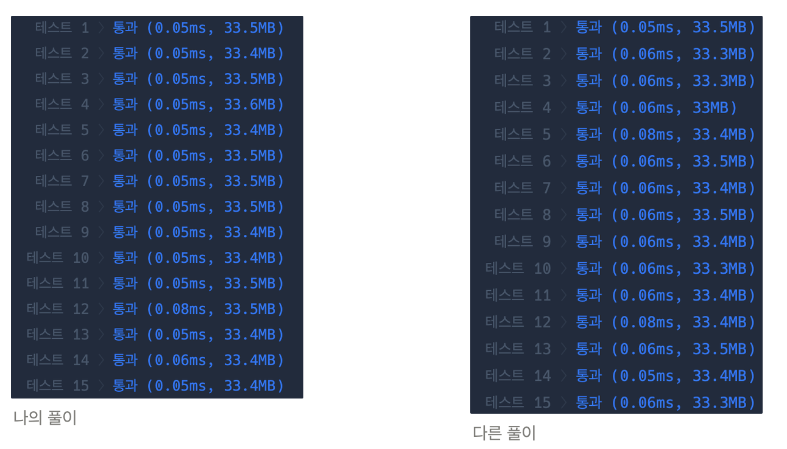

## 풀이

- 규칙

  로또와 맞는 번호를 제외하고 남는 번호들 중 맞출 수 있는 최대 개수는 0의 개수, 최소 개수는 0이다.
  (ex) 0의 개수가 4 → 최대 4개까지 다 맞출 수 있고, 최소로는 다 틀릴 수 있음

- hitCount(맞춘 개수)를 시작으로, 맞춘 번호 제외하고 나머지 중 0의 개수를 구하여 전체 맞춘 최대&최소 개수를 구함
- 0의 개수가 6인 경우, 6개 다 맞춘 경우, 6개 다 틀린 경우는 early return하고 그 외의 경우는 `등수(7 - hitCount)` 한 결과 return

## 다른 사람의 풀이

코드 가독성이 더 좋음 (for문을 선언형인 `.filter()`로 대체, 등수를 배열로 정의해두었음)

하지만 성능 측면에서는 나의 풀이 방법보다 살짝 떨어짐.

해당 풀이가 성능이 떨어지는 이유

1. `filter()`를 2번 사용하면서 새로운 배열을 반환하면서 오버헤드가 발생할 수 있음
2. Rank 반환할 때 인덱싱을 통해 배열에 접근하여 탐색하므로 오버헤드가 발생할 수 있음
3. 나의 코드에 있는 early return으로 인해 모든 케이스를 다 계산하지 않아도 됨

```js
function solution(lottos, win_nums) {
  const rank = [6, 6, 5, 4, 3, 2, 1];

  let minCount = lottos.filter((v) => win_nums.includes(v)).length;
  let zeroCount = lottos.filter((v) => !v).length;

  const maxCount = minCount + zeroCount;

  return [rank[maxCount], rank[minCount]];
}
```


