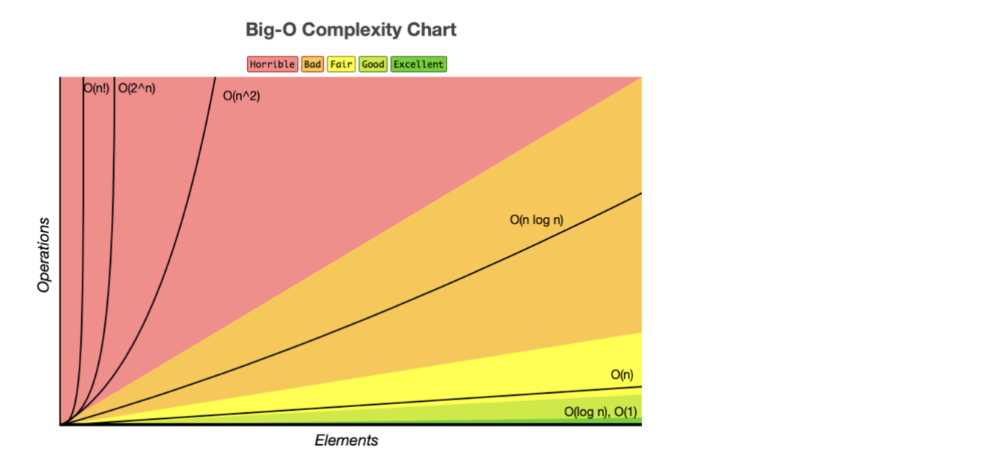

## 문제 풀이 사이트

- [LeetCode](https://leetcode.com/)
- [Programmers](https://programmers.co.kr/)

## 공부 방법

- 일주일에 2문제 이상 풀기, 언어는 js/ts 사용
- 풀이에 대한 시간복잡도 및 공간복잡도를 측정하고 개선 방안 생각해보기
- 다른 풀이를 참고한 경우에는 해당 알고리즘에서 어떤 자료구조가 사용되었는지 확인하고 공부해보기

## 시간 복잡도와 공간 복잡도

어떤 자료구조를 사용하냐에 따라 프로그램의 성능에 영향을 미치는 수치화 가능한 지표

- 공간복잡도(space complexity)

  프로그램 실행시 데이터들이 RAM에 올라가는데, RAM의 크기는 한정되어있으므로 `고정 요구 공간량(int, double, 크기가 정해진 배열) + 가변 요구 공간량(동적 할당 및 해제되는 데이터)`이 가장 적게 소비되는 방식 사용

- 시간복잡도(time complexity)

  `컴파일 타임 + 러닝 타임`. 러닝 타임은 컴퓨터 사양, 네트워크 환경 등에 따라 변수가 많으므로 컴파일 타임만 계산

### BigO 표기법

- 점근적 표기법: 입력값의 크기에 따른 함수의 증가량. 중요하지 않은 상수 및 계수를 제거하면 알고리즘의 실행시간에 가장 큰 영향을 미치는 성장률에 집중할 수 있음
- BigO는 점근적 표기법 중 최악의 케이스를 고려하는 방법 (평균에 가까운 성능으로 예측하기 위해)
- 시간 복잡도는 변수 `n` 의 크기에 따라 실행되는 명령어의 횟수
  → 결과에 가장 큰 영향을 미치는 것은 `n` 값

### 알고리즘 별 시간복잡도

> O(1) < O(log n) < O(n) < O(n×log n) < O(n2) < O(2n) < O(n!)

> 상수 함수 < 로그 함수 < 선형 함수 < 다항 함수 < 지수 함수 < 재귀 함수

- `O(1)`: Operation push / pop on Stack
- `O(log n)`: Binary Tree
- `O(n)`: for loop
- `O(n log n)`: Quick Sort, Merge Sort, Heap Sort
- `O(n^2)`: Double for loop**,** Insert Sort, Bubble Sort, Selection Sort
- `O(2^n)`: Fibonacci Sequence
